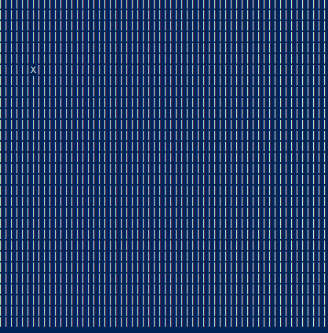

# fluid_dynamics

## This is a project to learn about c++ and how to use it. 
The goal for this project is to create a somewhat reasonable fluid dynamic simulation based on particle interaction.

## Technical goals:
- [ ] Learn general synthax for c++
- [ ] Use pointers somewhat correct
- [ ] Implement basic Euler-Lagrange mechanics for particle movements 

## Slightly moving particle

